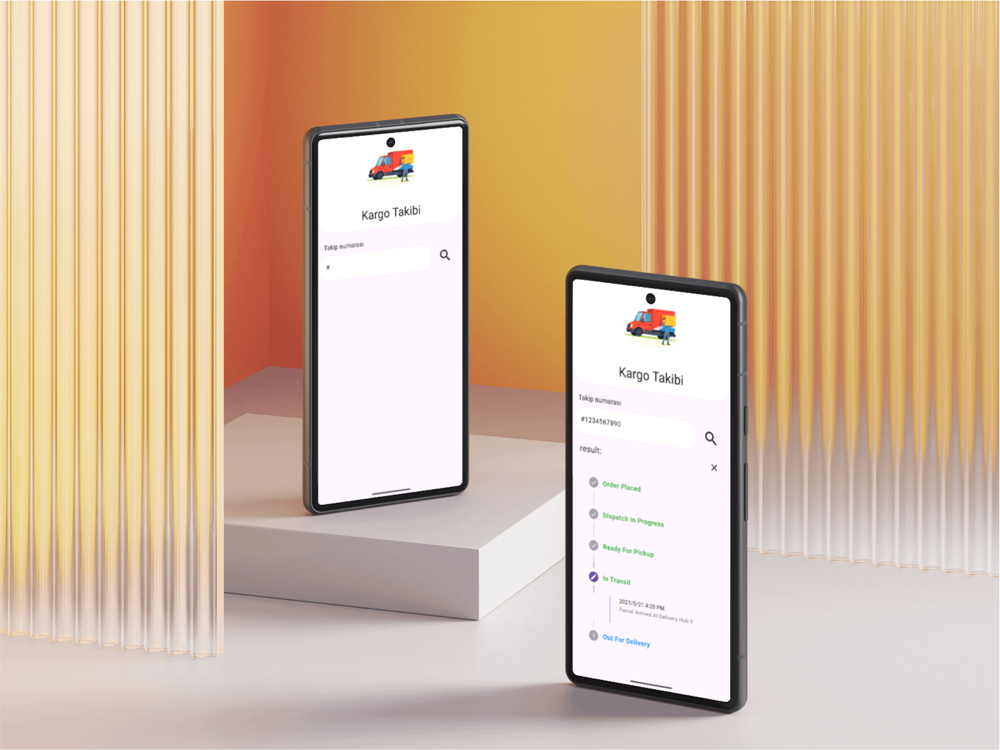

# Cargo Tracking App


A modern, user-friendly cargo tracking application! Instantly track the status of your shipments with ease.

## Table of Contents

- Features
- Screenshots
- Installation
- Usage
- Contributing
- Contact

## Features

- Track shipments using cargo/tracking numbers
- View detailed shipment status and history
- Modern and easy-to-use interface
- Manage and follow multiple shipments

## Screenshots



## Installation

```bash
# Clone the repository
git clone https://github.com/HuseyinKaanAkdeniz/Cargo-Tracking-App.git

# Navigate to the project directory
cd Cargo-Tracking-App

# Install dependencies
flutter pub get

# Run the application
flutter run
```
Minimum Flutter SDK: 3.10.0

## Usage

After launching the app, enter your cargo/tracking number to instantly view the current status of your shipment.

## Contributing

Contributions are welcome! Please open an issue to discuss your ideas before submitting a pull request.

- Fork the project
- Create a new branch (`git checkout -b feature-name`)
- Commit your changes (`git commit -m 'Add new feature'`)
- Push to the branch (`git push origin feature-name`)
- Open a pull request

## Contact

For more information: [simolexbusinnes@gmail.com](mailto:simolexbusinnes@gmail.com)  
Development insights: [My Medium Profile](https://medium.com/@kaanakdeniz)
